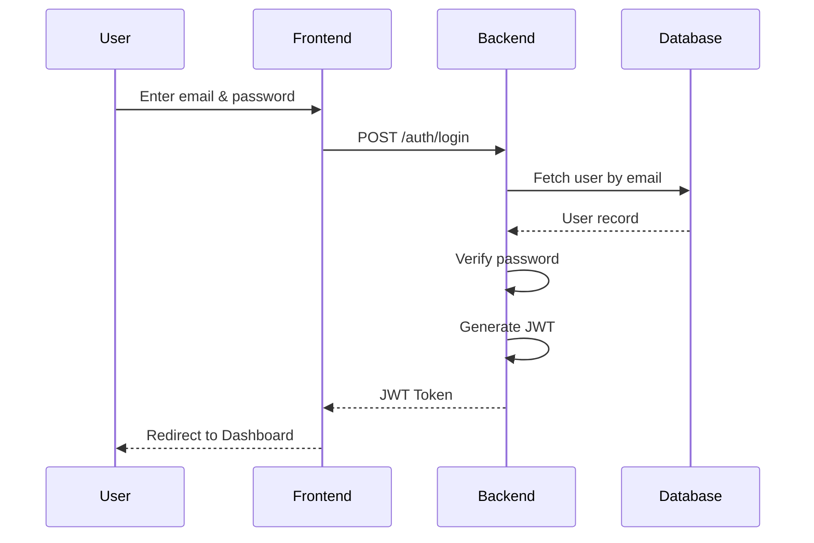

# Authentication

> **Project:** AI Concierge – Personalized AI Assistant

> **Document Version:** 1.0

> **Status:** Draft

---

# 1. Purpose

This document describes the authentication and authorization architecture of AI Concierge.

Authentication verifies **who the user is**, while authorization determines **what the user is allowed to access**.

The system uses JWT-based authentication for stateless API security and bcrypt for secure password hashing.

---

# 2. Authentication Goals

The authentication system should:

- Allow users to register securely
- Authenticate returning users
- Protect private APIs
- Prevent unauthorized access
- Keep passwords secure
- Support future OAuth login
- Scale to production environments

---

# 3. Authentication Architecture

```
                User
                  │
                  ▼
         React Frontend
                  │
          Login / Register
                  │
                  ▼
            FastAPI Backend
                  │
      Authentication Service
                  │
         Password Verification
                  │
                  ▼
            PostgreSQL
                  │
                  ▼
           Generate JWT
                  │
                  ▼
             Frontend
                  │
        Include JWT in Headers
                  │
                  ▼
        Protected API Endpoints
```

---

# 4. Authentication Components

```
auth/

├── router.py
├── service.py
├── repository.py
├── schemas.py
├── models.py
├── security.py
├── dependencies.py
└── exceptions.py
```

---

# 5. User Registration

## Workflow

```
User

↓

Register Form

↓

Validate Input

↓

Check Existing Email

↓

Hash Password

↓

Store User

↓

Return Success
```

---

## Registration Fields

| Field | Required |
|--------|----------|
| Full Name | Yes |
| Email | Yes |
| Password | Yes |
| Confirm Password | Yes |

---

## Validation Rules

### Name

- Minimum 3 characters
- Maximum 16 characters

---

### Email

- Must be valid
- Must be unique

---

### Password

Minimum:

- 8 characters

Must contain:

- One uppercase letter
- One lowercase letter
- One number

Recommended:

- One special character

---

# 6. Password Storage

Passwords are **never stored in plain text**.

Instead:

```
Password

↓

bcrypt Hash

↓

Database
```

Example:

```
User Password

↓

bcrypt

↓

$2b$12$...

↓

Stored
```

---

# 7. Login Flow

```
User

↓

Enter Email

↓

Enter Password

↓

Validate Credentials

↓

Generate JWT

↓

Return Token

↓

Redirect Dashboard
```

---

# 8. JWT Token Structure

The JWT contains:

```
{
    user_id,
    email,
    role,
    issued_at,
    expires_at
}
```

Sensitive information such as passwords is **never** included.

---

# 9. Token Lifecycle

```
Login

↓

JWT Created

↓

Frontend Stores Token

↓

Authenticated Requests

↓

Token Expires

↓

Login Again (MVP)

↓

Future:

Refresh Token
```

---

# 10. API Authentication

Every protected request includes:

```
Authorization:

Bearer <JWT_TOKEN>
```

Example:

```
GET /api/chat/history

Authorization: Bearer eyJhb...
```

---

# 11. Protected Endpoints

Authentication required:

- Chat
- Upload Document
- Memory
- Planner
- History
- Profile
- Settings

Public endpoints:

- Login
- Register
- Health Check

---

# 12. Authorization

Each user may access only their own:

- Conversations
- Documents
- Memory
- Profile
- Planner
- Settings

Every database query filters by `user_id`.

---

# 13. Session Management

MVP:

- Stateless JWT authentication
- No server-side session storage

Future:

- Refresh tokens
- Multi-device session tracking
- Session revocation

---

# 14. Logout

Logout consists of:

1. Remove JWT from client storage.
2. Redirect user to Login page.

Future:

- Maintain a token blacklist for early token revocation.

---

# 15. Forgot Password (Future)

Workflow:

```
User

↓

Forgot Password

↓

Enter Email

↓

Email Verification

↓

Reset Link

↓

New Password

↓

Login
```

---

# 16. OAuth Support (Future)

Planned providers:

- Google
- GitHub
- Microsoft

Benefits:

- Faster registration
- Fewer passwords to manage
- Enterprise compatibility

---

# 17. Database Schema

### Users Table

| Column | Type |
|---------|------|
| id | UUID |
| full_name | VARCHAR |
| email | VARCHAR |
| password_hash | TEXT |
| role | VARCHAR |
| created_at | TIMESTAMP |
| updated_at | TIMESTAMP |

---

# 18. Authentication Middleware

Every protected request follows:

```
Receive Request

↓

Read JWT

↓

Verify Signature

↓

Check Expiry

↓

Load User

↓

Attach User Context

↓

Continue Request
```

---

# 19. Error Handling

| Scenario | Response |
|----------|----------|
| Invalid Email | 401 Unauthorized |
| Wrong Password | 401 Unauthorized |
| Expired Token | 401 Unauthorized |
| Missing Token | 401 Unauthorized |
| Duplicate Email | 409 Conflict |
| Validation Error | 400 Bad Request |

Messages returned to users should be clear but not reveal sensitive information.

---

# 20. Security Best Practices

The authentication module should:

- Hash passwords with bcrypt
- Never log passwords
- Use HTTPS in production
- Validate all input
- Protect against brute-force attacks (future)
- Enforce authorization checks
- Store secrets in environment variables
- Rotate JWT signing keys if required

---

# 21. Mermaid Sequence Diagram



---

# 22. Future Improvements

Future authentication enhancements include:

- Refresh Tokens
- Multi-Factor Authentication (MFA)
- Device Management
- Account Lockout after repeated failures
- Login history
- Password reset emails
- OAuth providers
- Single Sign-On (SSO)

---

# 23. Summary

The authentication system provides secure user registration, login, and authorization using JWT and bcrypt. By keeping authentication stateless and separating authentication from authorization, the design remains simple for the MVP while allowing future enhancements such as OAuth, refresh tokens, and multi-factor authentication without significant architectural changes.
