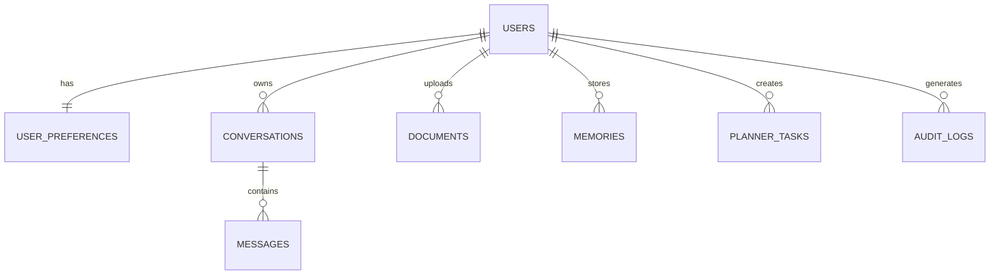
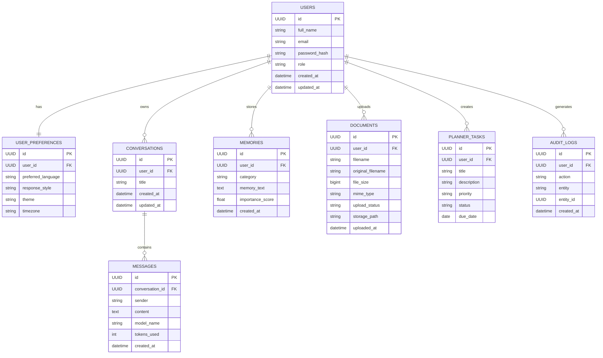

# ER Diagram

> **Project:** AI Concierge – Personalized AI Assistant

> **Document Version:** 1.0

> **Status:** Draft

---

# 1. Purpose

This document describes the Entity Relationship (ER) model of AI Concierge.

It defines:

- Database entities
- Relationships
- Cardinalities
- Primary Keys
- Foreign Keys
- Data ownership
- Normalization strategy

The ER model provides a visual representation of how relational data is organized in PostgreSQL.

---

# 2. Database Overview

AI Concierge uses a hybrid storage architecture.

```
                AI Concierge

                      │

        ┌─────────────┴─────────────┐

        ▼                           ▼

 PostgreSQL                   Qdrant

(Relational)             (Vector Database)

        │                           │

  Structured Data            Embeddings
```

This document covers **only PostgreSQL relationships**.

---

# 3. Main Entities

The MVP consists of the following entities:

- Users
- User Preferences
- Conversations
- Messages
- Memories
- Documents
- Planner Tasks
- Audit Logs

---

# 4. High-Level ER Diagram



---

# 5. Detailed ER Diagram



---

# 6. Relationship Explanation

## Users ↔ User Preferences

Relationship:

```
One-to-One
```

Each user owns exactly one preference profile.

Example:

```
Sharanya

↓

Preferred Language = English

↓

Theme = Dark

↓

Response Style = Detailed
```

---

## Users ↔ Conversations

Relationship

```
One-to-Many
```

One user may have multiple conversations.

Example

```
Aruna

├── Dietician cost

├── "Nutrition for new mothers" course

├── Strength training exercises for elder people
```

---

## Conversations ↔ Messages

Relationship

```
One-to-Many
```

Each conversation contains multiple messages.

```
Conversation

↓

Message 1

↓

Message 2

↓

Message 3
```

---

## Users ↔ Documents

Relationship

```
One-to-Many
```

Each uploaded document belongs to exactly one user.

```
User

↓

PDF 1

↓

PDF 2

↓

PDF 3
```

---

## Users ↔ Memories

Relationship

```
One-to-Many
```

Users accumulate many memories over time.

Examples

- Career Goal

- Learning Style

- Preferred Language

- Interests

---

## Users ↔ Planner Tasks

Relationship

```
One-to-Many
```

Each planner task belongs to one user.

---

## Users ↔ Audit Logs

Relationship

```
One-to-Many
```

Every important action performed by the user creates an audit log.

Examples:

- Login
- Logout
- Upload PDF
- Delete Conversation

---

# 7. Primary Keys

| Table | Primary Key |
|---------|-------------|
| Users | id |
| User Preferences | id |
| Conversations | id |
| Messages | id |
| Memories | id |
| Documents | id |
| Planner Tasks | id |
| Audit Logs | id |

All primary keys use UUIDs.

---

# 8. Foreign Keys

| Table | Foreign Key | References |
|---------|-------------|------------|
| user_preferences | user_id | users.id |
| conversations | user_id | users.id |
| documents | user_id | users.id |
| memories | user_id | users.id |
| planner_tasks | user_id | users.id |
| audit_logs | user_id | users.id |
| messages | conversation_id | conversations.id |

---

# 9. Cardinality Summary

| Relationship | Cardinality |
|--------------|-------------|
| User → Preferences | 1 : 1 |
| User → Conversations | 1 : N |
| User → Documents | 1 : N |
| User → Memories | 1 : N |
| User → Planner Tasks | 1 : N |
| User → Audit Logs | 1 : N |
| Conversation → Messages | 1 : N |

---

# 10. Data Ownership

Ownership rules ensure proper authorization.

| Entity | Owner |
|----------|-------|
| Preferences | User |
| Conversations | User |
| Messages | Conversation Owner |
| Documents | User |
| Memories | User |
| Planner Tasks | User |
| Audit Logs | User |

Every query must be scoped to the authenticated user's ID.

---

# 11. Referential Integrity

The database enforces referential integrity using foreign key constraints.

Examples:

- A message cannot exist without a conversation.
- A conversation cannot exist without a user.
- A memory cannot exist without a user.
- A planner task cannot exist without a user.

---

# 12. Cascade Behavior

Recommended cascade rules:

| Parent | Child | On Delete |
|----------|--------|-----------|
| User | Preferences | CASCADE |
| User | Conversations | CASCADE |
| User | Documents | CASCADE |
| User | Memories | CASCADE |
| User | Planner Tasks | CASCADE |
| User | Audit Logs | CASCADE |
| Conversation | Messages | CASCADE |

Deleting a user removes all associated records.

---

# 13. Normalization

The relational schema follows **Third Normal Form (3NF)**.

Benefits:

- Eliminates redundant data
- Prevents update anomalies
- Simplifies maintenance
- Ensures consistency

---

# 14. Future Entities

The following tables are planned for future releases:

| Table | Purpose |
|---------|---------|
| rag_chunks | Chunk metadata |
| llm_requests | Token usage & cost tracking |
| feedback | User ratings |
| recommendations | Personalized suggestions |
| notifications | Reminder system |
| user_sessions | Refresh tokens |
| prompt_templates | Prompt management |
| agent_runs | Agent execution logs |
| conversation_summaries | Long-context optimization |

These entities are intentionally excluded from the MVP to keep the initial implementation manageable.

---

# 15. Future ER Diagram (Conceptual)

```text
Users

│

├── Preferences

├── Conversations

│      ├── Messages

│      └── Conversation Summary

├── Documents

│      └── RAG Chunks

├── Memories

├── Planner

├── Recommendations

├── Notifications

├── Sessions

└── Audit Logs
```

---

# 16. Design Principles

The database design follows these principles:

- One source of truth for each entity
- UUID-based primary keys
- Explicit foreign key relationships
- Normalized relational schema
- Clear ownership boundaries
- Separation of relational and vector data
- Easy extensibility

---

# 17. Summary

The AI Concierge relational database is centered around the **User** entity. Every major feature—conversations, documents, memories, planner tasks, and preferences—is associated with a specific user, ensuring secure data ownership and straightforward authorization. Combined with Qdrant for semantic embeddings, this ER model forms the foundation of a scalable, production-ready AI platform.
